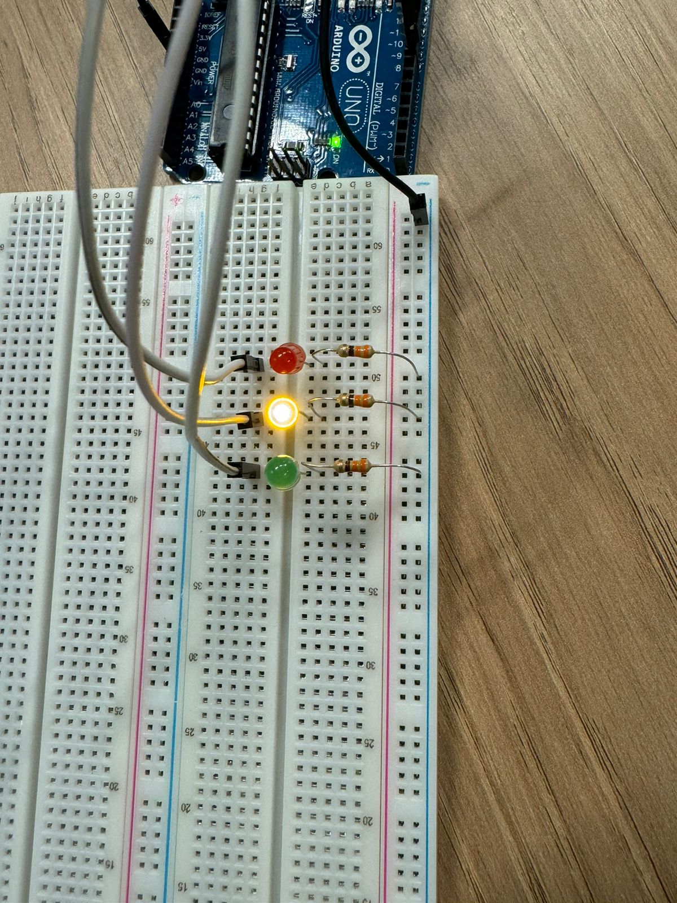
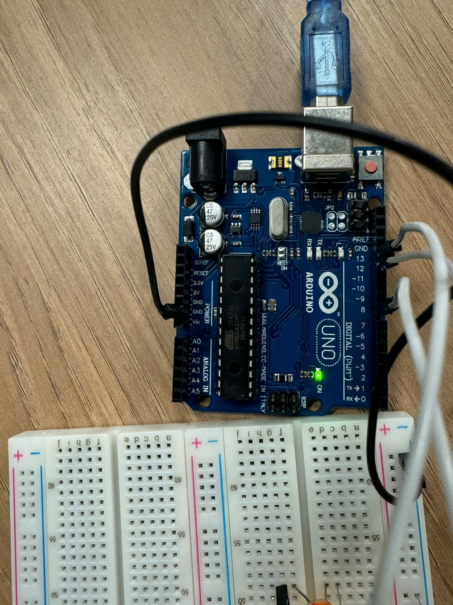
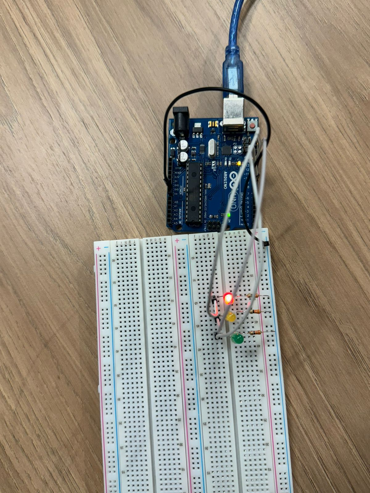

- tabela
- dvd nomes

# Atividade - Semáforo offline

 

### Relato da Montagem e Conexões

A montagem do semáforo foi realizada em uma protoboard conectada a um Arduino Uno. LEDs vermelho, amarelo e verde foram inseridos na protoboard, representando as fases do semáforo. Cada LED foi conectado ao Arduino usando os seguintes pinos:
- **LED vermelho** no pino 13
- **LED amarelo** no pino 12
- **LED verde** no pino 8

Para proteger os LEDs de corrente excessiva, foi adicionado um resistor de 220 ohms em série com cada LED. O cátodo (terminal negativo) de cada LED foi conectado ao barramento de GND na protoboard, que está ligado ao GND do Arduino. Esse circuito permite o controle sequencial de cada LED com os tempos programados para simular um semáforo.

### Especificações dos Componentes Utilizados

| Componente    | Quantidade | Especificação                  |
|---------------|------------|--------------------------------|
| Arduino Uno R3  | 1          | Microcontrolador ATmega328P    |
| LED Vermelho  | 1          | 5mm, 2V, 20mA                 |
| LED Amarelo   | 1          | 5mm, 2V, 20mA                 |
| LED Verde     | 1          | 5mm, 2V, 20mA                 |
| Resistor      | 3          | 330Ω               |
| Protoboard    | 1          | Tamanho padrão, sem solda      |
| Fios Jumper   | Vários     | Conexão entre Arduino e LEDs   |

Essa montagem foi realizada com o objetivo de simular um sistema de semáforo seguindo a lógica de tempo para cada cor de LED diferente.

### Tabela de Avaliação entre Pares 1

#### Avaliador: Ryan Gartlan | Avaliado: David Deodato

|Critério|	Contempla (Pontos)|	Contempla Parcialmente (Pontos)	|Não Contempla (Pontos)	|Observações do Avaliador|
|-|-|-|-|-|
|Montagem física com cores corretas, boa disposição dos fios e uso adequado de resistores	| 3	| 0 |0 |fez a montagem correta, nas cores corretas e boa disposição dos fios |	
|Temporização adequada conforme tempos medidos com auxílio de algum instrumento externo	| 3	|0	|0 | usou o milis para medir o tempo, fazendo um temporizador |	
|Código implementa corretamente as fases do semáforo e estrutura do código (variáveis representativas e comentários) | 3| 0 |	0 | fez a sequência correta e ainda validou com o professor |	
|Ir além: Implementou um componente de extra, fez com millis() ao invés do delay() e/ou usou ponteiros no código | 1 | 0  | 0 | usou millis e usou buser |	
| | | | |Pontuação Total = 10 |

### Tabela de Avaliação entre Pares 2

#### Avaliador: David Deodato | ### Avaliado: Ryan Gartlan

|Critério|	Contempla (Pontos)|	Contempla Parcialmente (Pontos)	|Não Contempla (Pontos)	|Observações do Avaliador|
|-|-|-|-|-|
|Montagem física com cores corretas, boa disposição dos fios e uso adequado de resistores	| 3	| 0 |0 |fez a montagem correta, nas cores corretas e boa disposição dos fios, deixando claro quais são quais |	
|Temporização adequada conforme tempos medidos com auxílio de algum instrumento externo	| 3	|0	|0 | usou o miles para medir o tempo |	
|Código implementa corretamente as fases do semáforo e estrutura do código (variáveis representativas e comentários) | 3| 0 |	0 | fez a sequência correta |	
|Ir além: Implementou um componente de extra, fez com millis() ao invés do delay() e/ou usou ponteiros no código |	0 | 0  |	0 | não foi além |	
| | | | |Pontuação Total = 9 |
